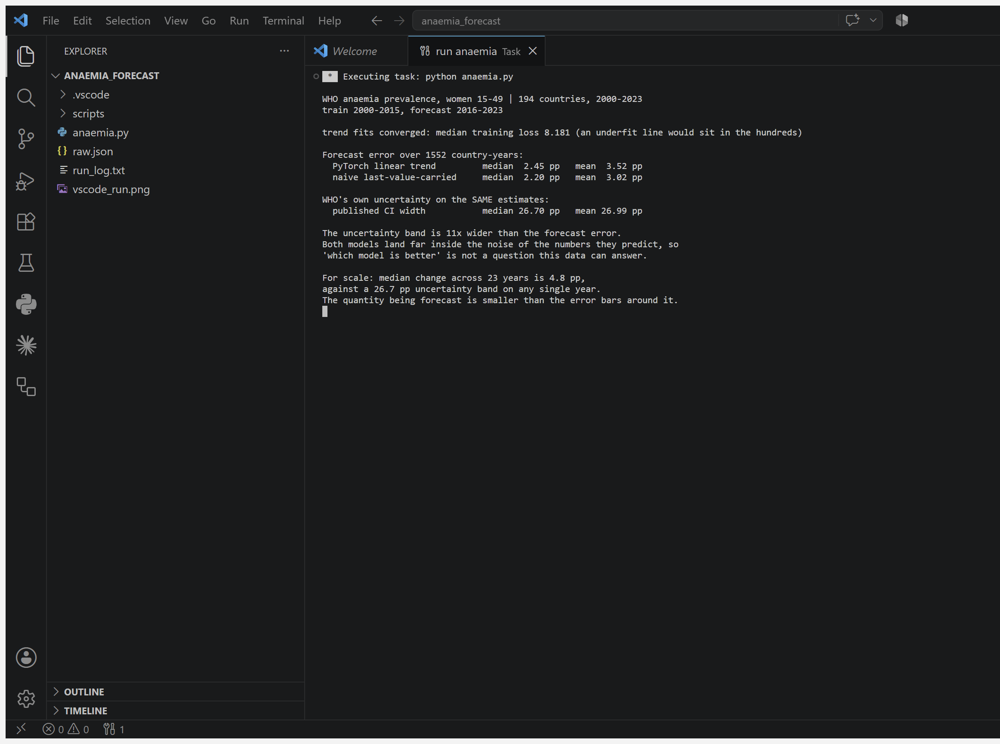

# Anaemia in Women — forecasting a number smaller than its own error bar 🩸

**WHO's uncertainty band on these estimates is 26.7 points wide. The total change
being forecast is 4.8 points across 23 years.** The quantity is smaller than the
error bars around it, and no model fixes that.

| | Median error | Mean error |
|---|---|---|
| PyTorch linear trend | 2.45 pp | 3.52 pp |
| naive "assume nothing changed" | **2.20 pp** | **3.02 pp** |
| **WHO's published uncertainty on the same estimates** | **26.70 pp** | 26.99 pp |

The trained model does not beat carrying the last value forward. Both land
**11× inside** the noise of the numbers they are predicting.

## The problem

WHO Global Health Observatory, indicator `NUTRITION_ANAEMIA_REPRODUCTIVEAGE_PREV`:
anaemia prevalence in women aged 15–49, 194 countries, 2000–2023. Anaemia affects
roughly a third of women of reproductive age worldwide and contributes to maternal
mortality, so forecasting it is a real policy question.

Standard exercise: train on 2000–2015, forecast 2016–2023, report the error. This
repo does that, then does the part the standard exercise skips — **it compares the
forecast error against the uncertainty WHO publishes alongside every single
estimate.**

## The bug I shipped into my own first result

My first run reported the trend model at **14.83 pp error** — six times worse than
the naive baseline. It looked like a clean finding: "trend extrapolation fails on
health data."

It was my bug. At 300 epochs the fit had not converged — training loss 293 versus
0.42 at 2000 epochs. An underfit line looks exactly like a failed method. After
fixing the epoch count the error dropped to 2.45 pp and the real result appeared:
the trend model is *fine*, it just has nothing to beat.

The script now prints median training loss on every run so the reader can check
convergence rather than trust me. A finding that disappears when you train
properly was never a finding.

## What the comparison shows

- The trained model **loses to doing nothing** (2.45 vs 2.20 pp). When a series
  barely moves, "assume no change" is a genuinely strong baseline.
- Both errors sit far inside WHO's own ±13-point uncertainty. Reporting that one
  model is 0.25 pp better than another is reporting noise with a decimal point.
- **These are modelled estimates, not measurements.** All 194 countries have a
  value for all 24 years — including countries that ran no national survey in most
  of them. The wide intervals are WHO being honest about that. Training on this
  data is modelling a model's output, and the error bars are the tell.

Previous entries in this series found leaks
([duplicate rows](https://github.com/sravanni369/maternal-risk-pytorch),
[the label in the feature table](https://github.com/sravanni369/birthweight-leakage-pytorch))
and a [model that lost to a majority baseline](https://github.com/sravanni369/cervical-screening-pytorch).
This one is different: the modelling is fine, the *precision* is fake.

## Run it

```bash
pip install torch
curl -o raw.json "https://ghoapi.azureedge.net/api/NUTRITION_ANAEMIA_REPRODUCTIVEAGE_PREV"
python anaemia.py
```

stdlib + PyTorch only, CPU, a couple of minutes for 194 country fits. Full unedited
output in [`run_log.txt`](run_log.txt); the run captured live in VS Code:



## Honest scope

A per-country straight line is a deliberately simple model; ARIMA or a hierarchical
model pooling across countries would likely fit better, and it would not change the
conclusion, because the limit here is the uncertainty in the source estimates rather
than the flexibility of the forecaster. Country-level prevalence says nothing about
any individual woman, and aggregate trends hide within-country inequality — the
women worst affected are not the average. Nothing here is a health projection; WHO
publishes those with proper uncertainty propagation, which this does not attempt.

**Source:** WHO Global Health Observatory (accessed 4 Aug 2026), indicator
`NUTRITION_ANAEMIA_REPRODUCTIVEAGE_PREV`. Linear regression and time-based splits —
[Dive into Deep Learning](https://d2l.ai) ch. 3, [ISLP](https://www.statlearning.com)
ch. 3. Adapted, not transcribed.
